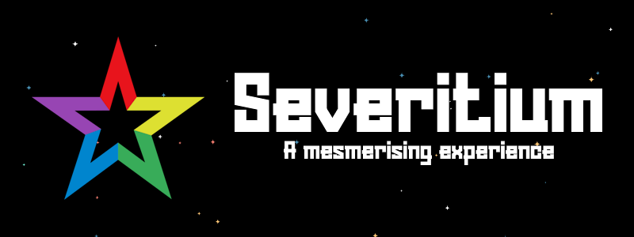

# Severitium

## :black_heart: Vibrant, interactive, memorable

Free open-source theme for [Tanki Online](https://tankionline.com/).

Modern animations, custom colors, original bug fixes: it's all possible!

To find out compatibility, check [browser compatibility](#-browser-compatibility)

Check the [preview](https://youtu.be/pFkgSHNhcug) of the Severitium theme.

See the [changelog](CHANGELOG.md)

```javascript
/* - - - - - - - - */
/* - - - - - - - - */
/* - - - - - - - - */
/* - - - - - - - - */

/* The project is under development */

/* - - - - - - - - */
/* - - - - - - - - */
/* - - - - - - - - */
/* - - - - - - - - */
```

## :bulb: Getting Started

> [!NOTE]
> Keep in mind that when you first load or update the script, it takes some time for the interface to load.

### Browser

1. Download [Tampermonkey](https://www.tampermonkey.net/)

2. Add or update [script](https://severitium-builds.vercel.app/api/stable/web) in Tampermonkey

### Client

#### Automatic Installation

1. Download [Tanki Online Client](https://tankionline.com/)

2. Download and run `VibeTOInstaller.exe` from [VibeTO releases](https://github.com/OrakomoRi/VibeTO/releases/latest). The installer automatically locates the game directory, downloads components, backs up original files, patches the game, and creates the `mods` folder.

   > **Note:** The installer may be flagged by Windows SmartScreen. Click "More info", then "Run anyway" to proceed.

3. Download `severitium.client.js` from [here](https://severitium-builds.vercel.app/api/stable/client) and place it in the `mods` folder:
   - **Windows:** `%APPDATA%\VibeTO\mods\`
   - **macOS:** `~/Library/Application Support/VibeTO/mods/`
   - **Linux:** `~/.config/VibeTO/mods/`

#### Manual Installation

If the installer does not work, follow these steps manually:

1. Download `app.asar` and place it at (make a backup of the original first):
   - **Windows:** `%LOCALAPPDATA%\Programs\Tanki Online\resources\app.asar`
   - **macOS:** `/Applications/Tanki Online.app/Contents/Resources/app.asar`
   - **Linux:** `~/.local/share/TankiOnline/resources/app.asar`

2. Download `mod-loader.js` and place it in the VibeTO data folder:
   - **Windows:** `%APPDATA%\VibeTO\`
   - **macOS:** `~/Library/Application Support/VibeTO/`
   - **Linux:** `~/.config/VibeTO/`

3. Create the `VibeTO` data folder and `mods` subfolder for your platform (if they don't exist):
   - **Windows:** `%APPDATA%\VibeTO\mods\`
   - **macOS:** `~/Library/Application Support/VibeTO/mods/`
   - **Linux:** `~/.config/VibeTO/mods/`

4. Download `severitium.client.js` from [here](https://severitium-builds.vercel.app/api/stable/client) and place it in the `mods` folder


## :rocket: Browser Compatibility

Here's the list of browsers and their versions which support the code. On the other side for simple script using is needed Tampermonkey extension.

### :warning: Warning

- :x: Doesn't fully support IE11
- :x: Not compatible with Opera Mini

### :white_check_mark: PC

Browser|Version
-|:-:
Google Chrome|105+
Edge|105+
Safary|15.4+
Firefox|121+
Opera|91+

### :white_check_mark: Mobile

Browser|Version
-|:-:
Opera Mobile|73+
Android Browser|122+
Google Chrome for Android|122+
Firefox for Android|123+
Safary for iOS|15.4+
Samsung Internet|20+

## :zap: Built With

- [HTML5](https://developer.mozilla.org/en-US/docs/Web/HTML)
- [CSS3](https://developer.mozilla.org/en-US/docs/Web/CSS)
- [JavaScript](https://www.javascript.com/)

## :wave: Special Thanks

- Contributors to logic: [PancakeSoup](https://github.com/Senijs), [hopzy](https://github.com/hopzy1)

- Contributors to design: Mondstrahl

- Additional ideas: [N3onTechF0X](https://github.com/N3onTechF0X), Maria4554, reversedqq

### :sunny: Inspiration

The idea for the background for the loading screen (canvas with stars) was ispired by [xeon](https://github.com/xeon-git).

The idea of popups and alerts was inspired by [SweetAlert2](https://sweetalert2.github.io/).

## :coin: Support me

Any donations would be appreciated

- [Boosty](https://boosty.to/orakomori/donate)
- [Patreon](https://www.patreon.com/orakomori)
-  **BTC**: *bc1qujagmeactpljqa03ywhul5zpa62ru9g0280f3c*
- **USDT (BNB Smart Chain)**: *0x8c7393091428d9A3b44fF4436217d8EbD33e7990*
- **USDT (Tron)**: *TQj3EjdQXv8fhRsf3eXWowxz7YpYvYEoLU*
- **USDT (Solana)**: *2UKZe2J4TohqFsF1kQRqmCXqwCcdUJkAvcM6ByZiqds8*

## :page_facing_up: License

Distributed under the MIT License. See `LICENSE` for more information.

## :star: Acknowledgments

- [CSS Autoprefixer](https://autoprefixer.github.io/)
- [Tampermonkey Docs](https://www.tampermonkey.net/documentation.php?locale=en)
- [SVG Viewer](https://www.svgviewer.dev/)
- [Animate.css](https://animate.style/)